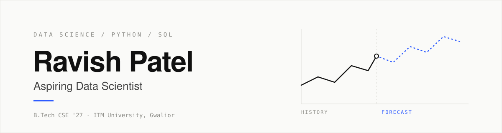

  

  
  
  

## About

I turn raw data into decisions. I build end-to-end projects in Python and SQL, from cleaning and analysis to forecasting and dashboards, and I'm working toward a Data Scientist role.

 

## Featured project

### [FORESIGHT: Demand & Inventory Intelligence](https://github.com/Ravish945/foresight-demand-inventory)

A retail planning dashboard that forecasts weekly demand and flags inventory risk.

| | |
|---|---|
| **Forecast** | 6 weeks, 29,571 units across 50 SKUs |
| **Best model** | Seasonal-naive, 11.5% WAPE (Random Forest: 12.0%) |
| **Validation** | 4 rolling backtest origins |
| **Inventory flags** | 7 reorder · 2 overstock · 41 healthy |

[Live demo](https://foresight-demand-inventory-gdzbkvidhzl37dztbrtd7s.streamlit.app/) · [10-page report](https://github.com/Ravish945/foresight-demand-inventory/blob/main/reports/FORESIGHT_Project_Report.pdf)

## Stack

`Python` `SQL` `pandas` `NumPy` `scikit-learn` `Plotly` `Streamlit` `Git` `Linux`

## Certifications

Intellipaat: Python, SQL, Data Science, Linux · Tata iQ GenAI-Powered Data Analytics Job Simulation (Forage)

## Now

Solving SQL problems on LeetCode · Building my next data project

